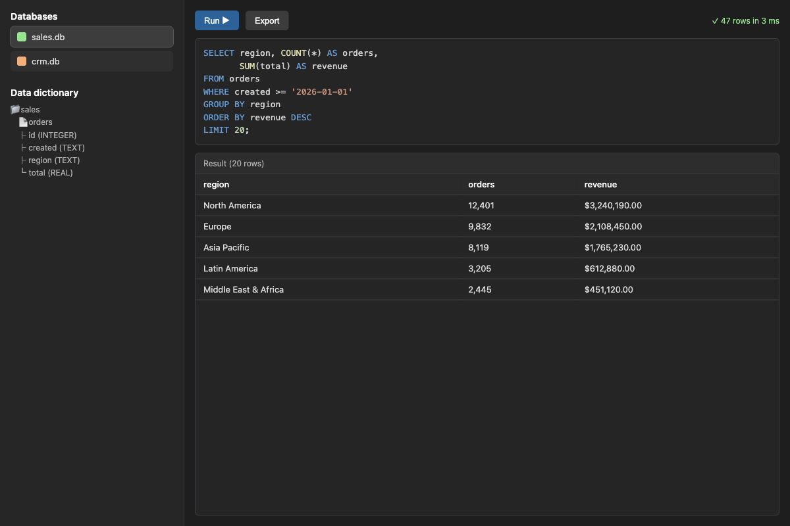

# Super Useful SQL

Query SQLite databases that live **outside** your vault with SQL, and read the results in a side
panel — without creating a single note.

Most database plugins ask you to store data *inside* the vault, which does not scale: tens of
thousands of rows become tens of thousands of files, and your vault index and sync pay for it.
Super Useful SQL is the other half of that workflow: keep the bulk data in ordinary `.db` files
anywhere on disk, and bring only the query and its result into Obsidian.



## Features

- **Side panel, not notes.** A dedicated view with a SQL box, a result table, query history and an
  optional export button. Queries never touch your notes.
- **Databases outside the vault.** Register any number of SQLite files by absolute path, each with
  a short alias.
- **Cross-database and cross-table joins.** The selected database is the main one (unqualified
  table names); every other registered database is attached under its alias, so `other.table`
  works in the same statement.
- **Data dictionary.** Point the plugin at a note describing databases, tables and columns; it
  renders as a tree in the panel and as tooltips on result column headers.
- **Read-only, enforced.** See [Security](#security) — the guarantees are mechanical, not
  conventional.
- **AI assistants.** If Copilot or Claudian is installed, the plugin offers to hand it a short
  instruction block so the assistant can run queries through Super Useful SQL. See
  [AI assistants](#ai-assistants).
- **English / Chinese UI**, following Obsidian's own language setting.

## Requirements

- Obsidian 1.13.0 or newer.
- Desktop only. SQLite runs through Node's built-in `node:sqlite`, which is not available on mobile.
- The `node:sqlite` module comes from Electron, and Electron comes from the *installer* — not from the
  app version. If the plugin reports that `node:sqlite` is unavailable, download the current installer
  from [obsidian.md](https://obsidian.md/download) and reinstall (app auto-updates do not refresh
  Electron).

## Install

**Manual:** copy `main.js`, `manifest.json` and `styles.css` into
`<your-vault>/.obsidian/plugins/super-useful-sql/`, then enable *Super Useful SQL* in
Settings → Community plugins.

**BRAT:** add this repository's URL in the BRAT plugin and install *Super Useful SQL*.

## Quick start

1. Create a SQLite file somewhere outside your vault, or use one you already have.
2. Settings → Super Useful SQL → **Add database**: set an alias (`sales`) and the absolute path
   (`/home/you/data/sales.db`).
3. Open the panel (ribbon database icon, or the command **Open query panel**).
4. Write SQL and press **Run** (or `Cmd/Ctrl+Enter`):

   ```sql
   SELECT region, COUNT(*) AS orders, SUM(total) AS revenue
   FROM orders
   WHERE created >= '2026-01-01'
   GROUP BY region
   ORDER BY revenue DESC
   LIMIT 20;
   ```

Cross-database query (main database = `sales`, other registered database attached as `crm`):

```sql
SELECT s.region, COUNT(*) AS n, c.owner
FROM orders s
JOIN crm.accounts c ON c.id = s.account_id
GROUP BY s.region
LIMIT 20;
```

## Data dictionary

Point **Data dictionary path** at a note; the panel parses it into a schema tree and uses it for
result column tooltips. The expected shape (headings accept English or Chinese words):

```markdown
## Database sales

- **Engine**: sqlite
- **Path**: /home/you/data/sales.db
- **Description**: what this database holds

### Table orders

One row per order.

| Column | Type | Description |
|---|---|---|
| id | INTEGER | primary key |
| created | TEXT | ISO `YYYY-MM-DD HH:MM:SS` |
| total | REAL | order total |
```

If the note does not exist yet, the panel offers to create a template.

## AI assistants

The plugin looks for an installed Copilot or Claudian plugin. When it finds one it offers, once, to
write a short instruction block describing the API:

```js
await app.plugins.plugins["super-useful-sql"].api.run("SELECT 1 AS ok", { db: "sales" });
// → { columns, rows, ms, error, warning, truncated }
```

Also available: `api.listDatabases()`, `api.dictionary()`, `api.instructions()`.

The block is written into the note set by **Instructions file**, wrapped in HTML-comment markers,
so re-running replaces it instead of appending duplicates. Paste it wherever your assistant reads
its context: a system prompt, a custom-prompt folder (Copilot's system-prompt folder is suggested
automatically when detected), or your own context file. Nothing is written until you press the
button or the notice action, and you can also just copy the block to the clipboard.

## Security

The databases are opened read-only, and that is enforced by the runtime rather than by parsing SQL:

| Guard | What it blocks |
|---|---|
| `new DatabaseSync(path, { readOnly: true })` | any write to the main database |
| `PRAGMA query_only = 1` | writes through attached databases |
| `setAuthorizer(...)` allow-list (SELECT / READ / FUNCTION / RECURSIVE / TRANSACTION / SAVEPOINT) | `INSERT`, `UPDATE`, `CREATE`, `DROP`, `ATTACH`, `PRAGMA`, … |
| `prepare(sql)` compiles one statement only | everything after the first `;` never executes |
| Text guard for `VACUUM` / `ATTACH` / `DETACH` | statements the authorizer does not intercept (`VACUUM INTO` writes to disk) |
| `node:sqlite` missing → refuse to run | silently degrading to an unchecked path |

Writes inside an expression are not possible either: `readfile()`/`writefile()`/`edit()` are
sqlite3 *shell* functions and do not exist in the library this plugin uses, and a function-name
deny-list rejects `load_extension` and friends.

There is no subprocess and no shell: SQL is compiled and executed in-process, so none of the
`sqlite3` command-line behaviours apply (dot-commands, option parsing, shell functions,
`~/.sqliterc`).

## Disclosures

- **Files outside the vault.** This plugin opens SQLite files **outside your vault**, at the
  absolute paths you register (plus their `-wal` / `-shm` sidecars). This is the point of the
  plugin: keep large datasets out of the vault so the vault index and sync stay fast. No directory
  is scanned and nothing is discovered automatically — only the exact paths you enter are opened,
  and they are opened read-only.
- **No network access**, no telemetry, no account, no payment.
- **Nothing is written to your vault** unless you ask for it: **Export**, **Write instructions**, or
  **Create template**.

## Privacy

- The plugin never edits your notes on its own. It writes only when you ask it to:
  **Export** (a Markdown file in the export folder), **Write instructions** (the marked block), or
  **Create template** (the dictionary stub).
- Query history is stored locally in the plugin's own `data.json` (in the plugin folder),
  capped and clearable (Settings → **Clear history now**) — not in your notes.
- Note that SQL text and results can be sensitive; the history file is plain text on disk.

## Limitations

- Desktop only (see Requirements).
- **No query timeout for SQLite.** Queries run in-process and cannot be interrupted. A pathological
  query (for example a join without a join condition) blocks the UI while it runs. Mitigations: the
  plugin streams rows and stops at **maxRows** (default 200,000) instead of materialising everything,
  and aggregates on huge cross products still take as long as they take — so keep join conditions and
  add `LIMIT` on large tables.
- One statement per call, no sqlite dot-commands, no `ATTACH`/`DETACH`/`PRAGMA`/`VACUUM` from the
  query box (registered databases are attached for you).
- `maxRows` also caps exports. Raise it (or set 0, not recommended) if you need a full dump.

## Development

Single-file, plain JavaScript — no build step. `main.js` is the source and the artifact.

```bash
# local install into a test vault
mkdir -p "<vault>/.obsidian/plugins/super-useful-sql"
cp main.js manifest.json styles.css "<vault>/.obsidian/plugins/super-useful-sql/"
# then reload Obsidian (Cmd/Ctrl+R) and enable the plugin
```

- `manifest.json` — plugin metadata; `versions.json` maps plugin version → minimum app version.
- `styles.css` — panel styling.
- Releases: tag `0.2.0`, attach `main.js`, `manifest.json` and `styles.css` to the GitHub release.

## License

MIT — see [LICENSE](LICENSE).
